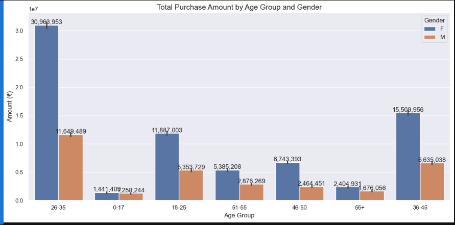

# Diwali Sales Analysis – Data Analyst Project

This project is focused on performing **Exploratory Data Analysis (EDA)** on a Diwali sales dataset using Python. The goal is to uncover insights that can help improve customer targeting and boost product sales during the festive season.

---

##  Project Learnings

- ✅ Performed **data cleaning and manipulation** using Pandas  
- ✅ Conducted **EDA using Pandas, Matplotlib, and Seaborn**  
- ✅ Improved customer experience by identifying:
  - Most active customer groups by **occupation, gender, and age groups**  
  - High-performing **states **
- ✅ Analyzed top-selling product categories and subcategories  
- ✅ Suggested **inventory planning strategies** based on demand trends

---

##  Tools & Libraries Used

- Python  
- Pandas  
- NumPy  
- Matplotlib  
- Seaborn  
- Jupyter Notebook

---

## Key Insights

- Most orders came from **Maharashtra**, **Karnataka**, and **Uttar Pradesh**  
-  Highest spending observed in customers aged **26–35 yrs**, especially **Married Women**  
-**Electronics**, **clothing** and **Food** were the top-performing categories  
- 
---

##  Visual Insights

### 🧍‍♀️ Total Amount Spent by Gender

  
> **Insight**: Female customers spent more than male customers during the Diwali season.

---

### 👨‍👩‍🦱 Total Amount Spent by Age Group

  
> **Insight**: Customers aged 26–35 were the highest spenders.

---

### 💍 Total Amount by Marital Status

  
> **Insight**: Married customers accounted for a higher total spend compared to unmarried ones.

---

### 🗺️ State-wise Sales

  
> **Insight**: UP, Maharashtra and Karnataka recorded the highest sales.

---

### 🛒 Top Product Categories

  
> **Insight**: Food, Clothing and Electronics were the most purchased categories.

## Files Included

- `Diwali_Sales_Analysis(2).ipynb` – Jupyter notebook with full analysis
- `Diwali Sales Data.csv` – Cleaned dataset used for analysis  
- `plots/` – Folder containing generated charts and visuals

---

##  How to Run

1. Clone this repo  
2. Open the notebook in Jupyter or VSCode  
3. Run each cell to replicate the analysis  
4. Optional: Use `requirements.txt` to set up your environment

---

##  Contact

If you liked this project or want a similar analysis, feel free to reach out:

📧 sawgatchettri001@gmail.com
 
